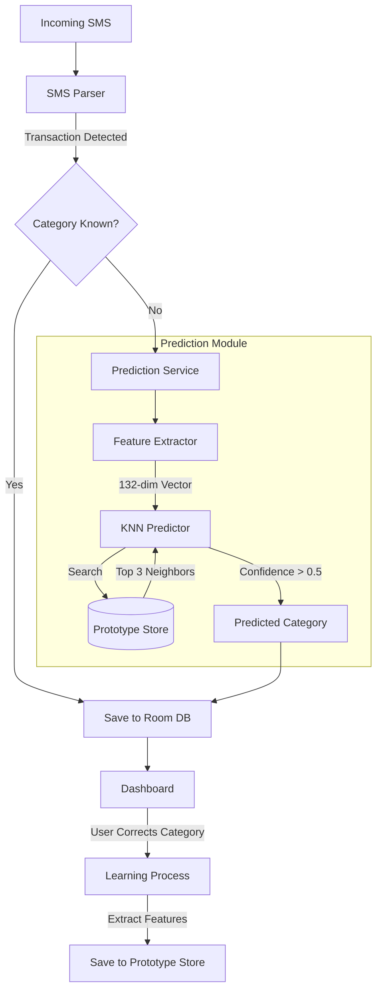

# SpendTracker Modeling Architecture

The SpendTracker application uses a localized **K-Nearest Neighbors (KNN)** algorithm for automated transaction categorization. This architecture is designed to be modular, privacy-focused, and capable of "lazy learning" from user behavior.

## High-Level Flow

## Modular Architecture

The system is split into two main modules:
1.  **`:app`**: Handles the UI, SMS reception, and primary transaction storage.
2.  **`:prediction`**: A pure Java/Android library containing the ML logic, feature extraction, and the "Vector Database".

## Local "Vector Database"
We do not use a specialized vector database like Pinecone or Milvus. Instead, we leverage **Room** as a high-performance local store for vectors.

-   **Prototype Store**: The `PrototypeEntity` in the `:prediction` module stores:
    -   The category label.
    -   A `float[]` representing the 132-dimensional feature vector.
    -   Metadata for future optimizations (merchant, amount, etc.).
-   **Euclidean Search**: When predicting, the `KNNPredictor` performs a linear scan over the `PrototypeEntity` table. Given that users typically have a few hundred to a few thousand prototypes, this O(N) scan is extremely fast on modern mobile CPUs.

## Feature Extraction (132 Dimensions)
The `FeatureExtractor` converts raw transaction data into a numerical vector:
1.  **Merchant Embedding (64 dims)**: A lightweight character-based hashing embedding of the merchant name.
2.  **UPI ID Embedding (64 dims)**: Similar embedding for the UPI identifier.
3.  **Numerical Features (4 dims)**:
    -   Log-normalized amount ($\log(1 + amount)$).
    -   Transaction type (Income vs Expense).
    -   Day of the week (normalized 0-1).
    -   Hour of the day (normalized 0-1).

## Training Process
-   **Lazy Learning**: The model doesn't "train" in the traditional batch sense.
-   **Online Update**: Every time you manually change a category in the dashboard, the app extracts the features for that transaction and saves it as a new "Prototype". The next time a similar transaction arrives, the KNN algorithm will find this prototype and suggest the corrected category.
